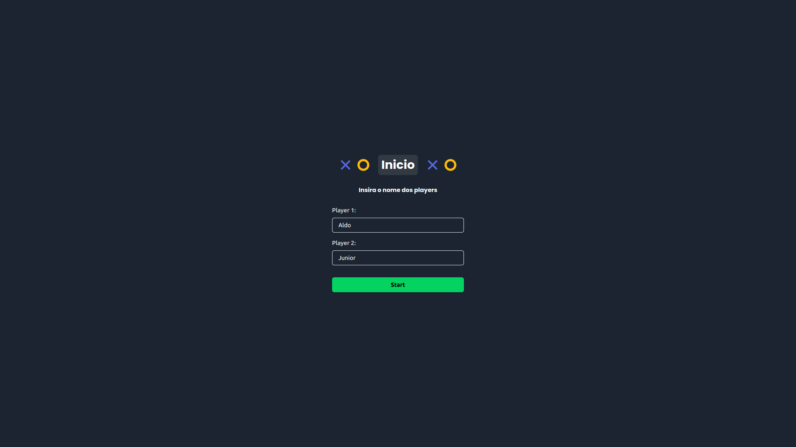
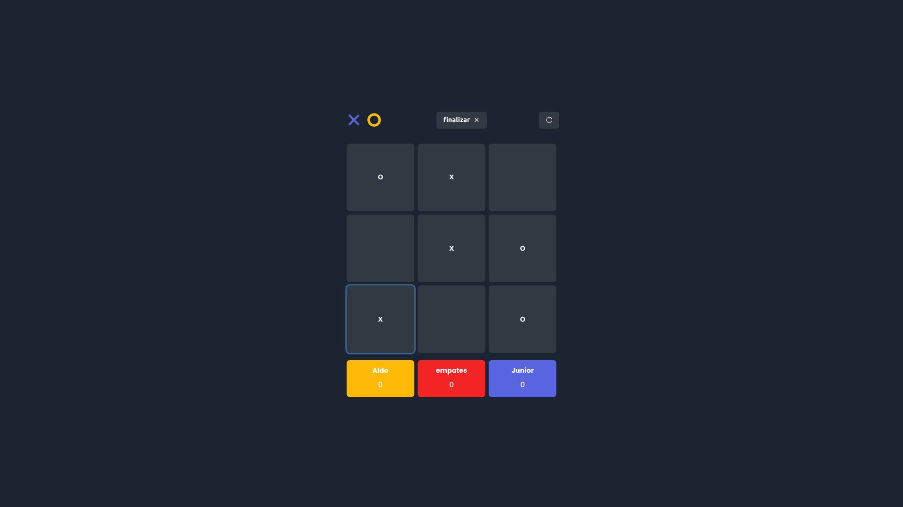

<h1 align="center">
  <strong>Tic-Tac-Toe</strong>
</h1>
<br>

## Sobre o projeto - About the project

Este projeto é um jogo da velha desenvolvido em React. Esta interface foi desenvolvida com ChakraUI e o funcionamento ocorre a partr de conceitos básicos do react como useState e contextos. Além disso, esta aplicação utiliza o boilerplate Vite react-ts.

This project is a tic-tac-toe game developed in React. This interface was developed with ChakraUI and it works based on basic concepts of react such as useState and contexts. Also, this application uses the Vite react-ts boilerplate.

<h1 align="center" display="flex">
   
</h1>
<h1 align="center" display="flex">
   
</h1>

## :computer: Tecnologias - Technologies

Este projeto foi desenvolvido com as seguintes tecnologias:
<br>
This project was developed with the following technologies:

- [React](https://pt-br.reactjs.org/)
- [TypeScript](https://www.typescriptlang.org/)
- [ChakraUI](https://chakra-ui.com/)
- [Vite](https://vitejs.dev/)
  <br>

## Como executar - How to execute

Para iniciá-lo, siga as etapas abaixo:
<br>
To start it, follow the steps below:

```bash
# Instale as dependencias
# Install dependencies
$ yarn

# Inicie o projeto
# start the project
$ yarn dev
```

O aplicativo estará disponível em seu navegador no endereço http://localhost:3000.
<br>
The app will be available in your browser at the address http://localhost:3000.
<br>
